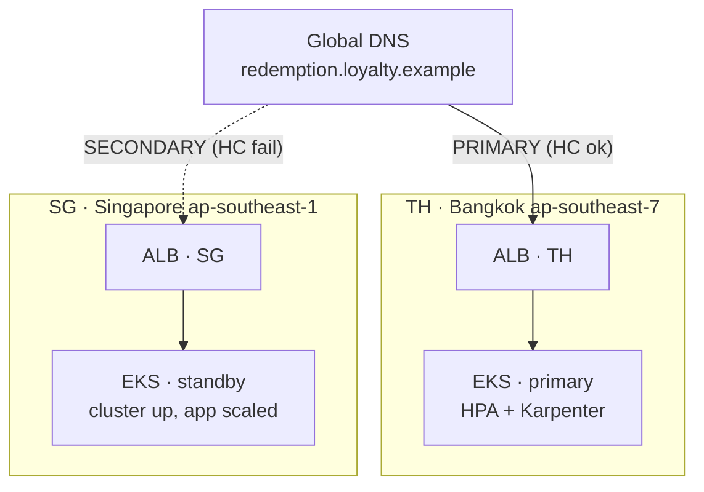
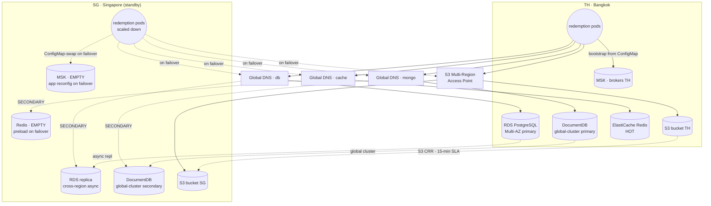

# Architecture — The Redemption Service

Active-standby across two regions. **Primary: Thailand (ap-southeast-7).
Secondary: Singapore (ap-southeast-1).** Every stateful service has its own
"Global DNS" hostname with failover routing so the application can survive
either a full regional outage or a single-service outage without code
changes — only the DNS resolution path flips.

## Top-level view

## Per-service Global DNS — active-standby data tier

## Per-service DR posture

| Service | Replication | DR steady state | Failover step in RD-01 | RPO |
|---|---|---|---|---|
| **EKS / app** | n/a (stateless) | Cluster up, ArgoCD synced, app deployments scaled to 0 | Step 3 — scale to baseline | n/a |
| **RDS PostgreSQL** | Cross-region async read replica | Replica receiving WAL | Step 2 — promote replica → writer | < 1 min |
| **DocumentDB** | Global cluster (managed) | Secondary cluster online | Step 2 — promote secondary | seconds |
| **ElastiCache Redis** | **None.** Cold standby | Cluster up, **empty** | Step 3b — preload hot keys from RDS (~5 min) | n/a (regenerable) |
| **S3** | Cross-region replication, RTC 15-min SLA | DR bucket receiving copies | none — Multi-Region Access Point routes automatically | < 15 min |
| **MSK Kafka** | **None.** Cold standby | Cluster up, **empty** | Step 4 — ConfigMap swap; consumers re-start from latest offset | accepted: events regenerable from RDS+Mongo |
| **ECR images** | Cross-region replication | All tagged images mirrored | none — DR cluster pulls from SG registry | seconds |

## Reading the diagram

- **One Global DNS per stateful service.** This is the central pattern. The app reads `db.loyalty.example`, `mongo.loyalty.example`, etc. — never the regional endpoint. On failover, the CNAME flips and the app doesn't notice.
- **Kafka is the only exception.** MSK bootstrap is a comma-separated broker list, which doesn't model cleanly as DNS. The app reads its broker list from a Kubernetes ConfigMap; ArgoCD swaps it during failover step 4. Trade-off documented in DESIGN.md.
- **S3 uses a Multi-Region Access Point**, not failover DNS. MRAP routes per-request to the closest healthy bucket via Global Accelerator — no flip, no preload step, no application change.
- **Redis and Kafka are intentionally cold.** Cache contents are regenerable from RDS + Mongo. Cross-region replication of cache is wasted spend; the architecture accepts a ~5-minute cache warm-up during the once-a-year DR exercise instead.
- **Split address space: nodes 10.x, pods 100.x.** The VPC carries a 100.64.0.0/16 secondary CIDR; VPC CNI custom networking (per-AZ ENIConfig) places pod ENIs there while nodes keep 10.x. Every data store has its own security group that allows ingress **only from the EKS pod security group** (SG reference, not CIDR), so the rule holds across the 100.x pod range and nothing outside the cluster can reach the data tier.

## Failure-mode mapping

| Failure | Detection | Automatic recovery | Operator action |
|---|---|---|---|
| Pod crash | liveness probe | kubelet restart | none unless CrashLoopBackOff > 10 min |
| Node loss (spot reclaim) | Karpenter SQS interruption | pre-drain + replacement node in <2 min | none |
| AZ outage in Bangkok | ALB health checks + topologySpreadConstraints | traffic shifts to surviving AZs, Karpenter scales there | confirm budget, run game-day checklist |
| RDS primary failure (single AZ) | RDS managed failover | Multi-AZ failover ~60 s; no region switch | none |
| Single data-service outage (RDS / Mongo / Redis) | health-check on the service DNS | service-level failover record flips | scale-up DR region capacity if other services also touched |
| Bad deploy | Argo Rollouts canary, error-rate analysis | auto-abort + rollback | review post-mortem |
| Full Bangkok region outage | Route 53 app health check + service health checks | DNS failover to Singapore for every service hostname | execute runbook RD-01: promote RDS, preload Redis, swap Kafka ConfigMap, scale EKS |

## draw.io source

The editable draw.io file at [`docs/architecture.drawio`](architecture.drawio) contains two pages:

- **Page 1 — Full Architecture.** Edge layer (Route 53 → CloudFront → WAF v2 → ALB), full VPC for both regions with public / private-app / private-data subnet bands, NAT gateways per AZ, EKS clusters with Karpenter nodes and pods, every data-tier service, ECR / KMS / Secrets Manager / GuardDuty / Security Hub, VPC Flow Logs + EKS audit logs, and the observability stack at the bottom.
- **Page 2 — Active-Standby Data Tier.** The simpler per-service Global DNS view showing how each stateful service fails over independently (matches the diagram you provided in the assessment thread).
